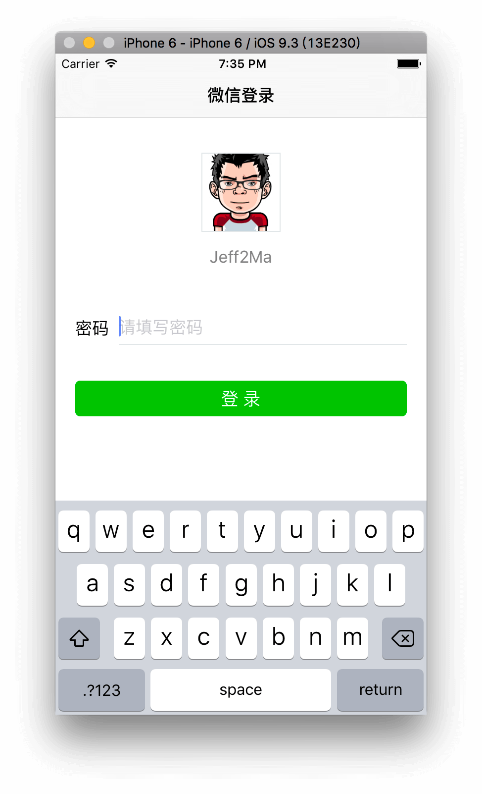
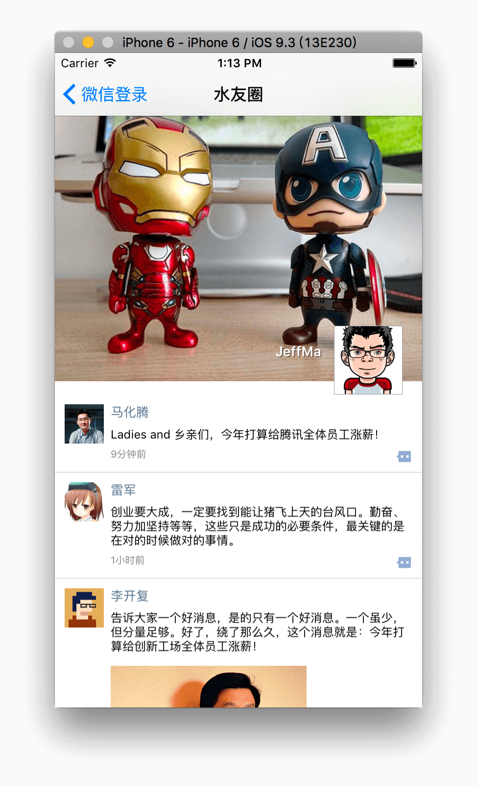
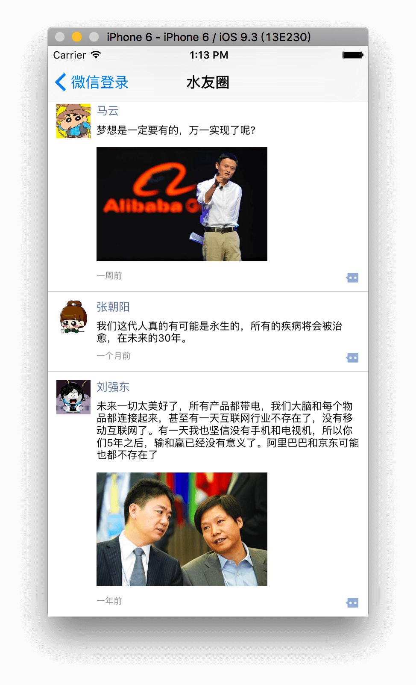
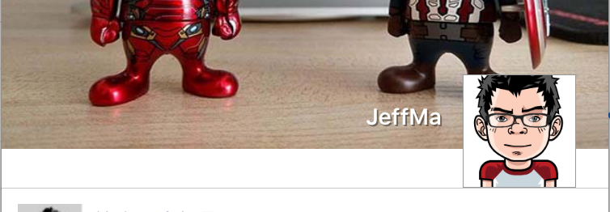

# iOS-WXmoment

> iOS 入门项目-使用 Objective-C 仿朋友圈信息流界面。
> 
> 另：Android 版本传送门：[Android-WXmoment](https://github.com/Jeff2Ma/Android-WXmoment)

## 说明

这个是本人入门 iOS 的第一个学习项目。从界面上仿微信登录界面及仿朋友圈信息流，暂不考虑逻辑层面的东西。

## Screenshot

### 登录


### 朋友圈头部



### 朋友圈



## 学习笔记

### 文本内容的尺寸计算

一段文字（string）根据文字的不同所产生的内容块的尺寸自然是不同，在旧版本 iOS 中可以使用如下代码获取：

``` Objective-C
NSString *strName = @"Jeff2Ma ";
CGSize nameSize = [strName sizeWithFont:aName.font constrainedToSize:CGSizeMake(MAXFLOAT, aName.frame.size.height)];
```
上面的代码在 Xcode 中会提醒使用最新的实现方式，修改后如下：

``` Objective-C
NSDictionary *attribute = @{NSFontAttributeName:[UIFont systemFontOfSize:16]};
CGSize nameSize = [strName boundingRectWithSize:CGSizeMake(1000, 20) options: NSStringDrawingUsesLineFragmentOrigin | NSStringDrawingTruncatesLastVisibleLine | NSStringDrawingUsesFontLeading attributes:attribute context:nil].size;
```

### UITextField 为密码的形式

``` Objective-C
self.aPassWordInput.secureTextEntry = YES; // 密码形式的输入
```

### UIButton 高亮状态下变背景色的方法

由于UIButton 没有类似- (void)setBackgroundColor:(UIColor *)color forState:(UIControlState)state 的方法，所以需要自己自定义。

方法一：
``` Objective-C
[self.LoginButton addTarget:self action:@selector(onLoginBtnClickedStyle:) forControlEvents:UIControlEventTouchDown];

#pragma mark - onLoginBtnClickedStyle
- (void)onLoginBtnClickedStyle:(UIButton *)sender{
    sender.backgroundColor = [UIColor colorWithRed:0.02 green:0.75 blue:0.01 alpha:0.80];
}
```

方法二：
``` Objective-C
    [self.LoginButton setBackgroundImage:[self imageWithColor:[UIColor blueColor]] forState:UIControlStateHighlighted];

+ (UIImage *)imageWithColor:(UIColor *)color {
    CGRect rect = CGRectMake(0.0f, 0.0f, 1.0f, 1.0f);
    UIGraphicsBeginImageContext(rect.size);
    CGContextRef context = UIGraphicsGetCurrentContext();
    
    CGContextSetFillColorWithColor(context, [color CGColor]);
    CGContextFillRect(context, rect);
    
    UIImage *image = UIGraphicsGetImageFromCurrentImageContext();
    UIGraphicsEndImageContext();
    
    return image;
}
```

### 设置下边框的方法

下边框指类似 CSS 中`border-bottom 的效果`，即上面 Screenshot 中的填写密码的UITextField。

导入第三方库：

``` Objective-C
#import <QuartzCore/QuartzCore.h>
```
设置一个名为 bottomBorder 的 CALayer

``` Objective-C
CALayer *bottomBorder = [CALayer layer];
bottomBorder.frame = CGRectMake(0.0f, self.aPassWordInput.frame.size.height - 1, self.aPassWordInput.frame.size.width, 1.0f);
bottomBorder.backgroundColor = [UIColor colorWithRed:226/255.0 green:230/255.0 blue:232/255.0 alpha:1].CGColor;
[self.aPassWordInput.layer addSublayer:bottomBorder];
```

### 为 UITableView 添加 Header 的两种方式

#### 方式一：SectionHeader 的方式

``` Objective-C
// 返回HeaderInSection高度
- (CGFloat) tableView:(UITableView *)tableView heightForHeaderInSection:(NSInteger)section
 {
 return 284;
 }
 
 //  TableView 添加 Section 自定义头部
-(UIView *)tableView:(UITableView *)tableView viewForHeaderInSection:(NSInteger)section{
 .....
 .....
 return self.aHeaderView;
 }
```

一开始本人是采用这种方式的，不过发现有坑：添加后发现在滚动的时候 Header 的区域并不能跟随滚动而是固定（相当于 fixed），查阅资料发现可以通过设置`UITableViewStyleGrouped`即可跟随滚动：

``` Objective-C
// 另外一种为 UITableViewStylePlain
self.aTableView = [[UITableView alloc]initWithFrame:self.view.bounds style:UITableViewStylePlain];
```

然后由此又带来一个问题，iOS 会在 Section 跟 TableView 中间增加一条分割线（如下图）。



因此后面是采用了方式二的。

#### 方式二：TableHeaderView 的方式（推荐）

``` Objective-C
UIView *headView = [UIView alloc]initWithFrame:CGRectMake(0, 0, 300, 100);
headView.backgroundColor = [UIColor redcolor];
...
myTableView.tableHeaderView = headView;
```

### TableView 去掉分割线默认的 margin left

``` Objective-C
- (void)tableView:(UITableView *)tableView willDisplayCell:(UITableViewCell *)cell forRowAtIndexPath:(NSIndexPath *)indexPath
{
    if ([cell respondsToSelector:@selector(setSeparatorInset:)])
    {
        [cell setSeparatorInset:UIEdgeInsetsZero];
    }
    if ([cell respondsToSelector:@selector(setPreservesSuperviewLayoutMargins:)])
    {
        [cell setPreservesSuperviewLayoutMargins:NO];
    }
    if ([cell respondsToSelector:@selector(setLayoutMargins:)])
    {
        [cell setLayoutMargins:UIEdgeInsetsZero];
    }    
}

``` 

### TableView 删除最后一条分割线

放在上面的方法代码内：

``` Objective-C
if ( indexPath.row ==  self.dataArray.count - 1 ) {
   cell.separatorInset = UIEdgeInsetsMake(0, 0, 0, CGRectGetWidth(tableView.bounds));
}
    
``` 

### 朋友圈信息流设计的 MVC 思想

- 使用MVC的框架，遵循类与类之间低耦合、高聚合的思想，能封装则封装。
- Controller 只负责处理事件。
- Cell（View）只负责显示界面。
- Model 负责数据的处理。


## 参考资料

http://www.samirchen.com/ios-start-1

http://www.cnblogs.com/wendingding/p/3761730.html

http://www.jianshu.com/p/61ab709663d9

